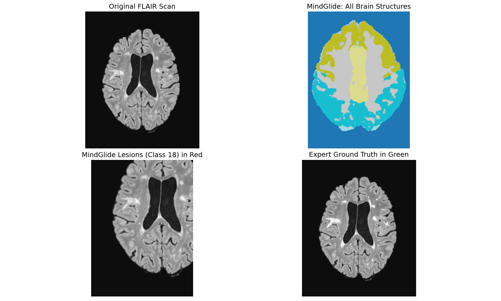
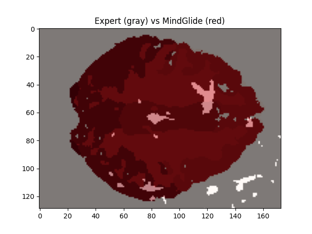

# MindGlide-MS

**Automated Multiple Sclerosis Lesion Segmentation using Deep Learning**

MindGlide-MS integrates the **MindGlide** lesion segmentation model with the open-access **MSSEG1 MRI dataset**, enabling automated and reproducible lesion detection on MRI scans of MS patients. The repository includes all data, models, and processing pipelines packaged within a Docker environment for easy setup and deployment.

---

## Repository Structure

```
mindglide-ms/
├── data/
│   └── msseg1/            # Submodule: Open MS Dataset (https://github.com/muschellij2/open_ms_data)
├── models/
│   └── mindglide/         # Submodule: MindGlide segmentation model (https://github.com/mMedcon/mindGlide)
├── notebooks/             # Example analysis and visualization notebooks
├── src/                   # Helper scripts for preprocessing / evaluation
├── environment.yml        # Conda environment specification
├── Makefile               # Optional build commands
├── LICENSE
└── README.md
```

---

## Getting Started

### Clone the Repository (with Submodules)

```bash
git clone --recurse-submodules https://github.com/mMedcon/mindglide-ms.git
cd mindglide-ms
```

This ensures all submodules (data and models) are cloned alongside the main repository.

---


If you already cloned without `--recurse-submodules`, run:

```bash
git submodule update --init --recursive
```

---

### Setup

If you’re not using Docker, create the environment manually:

```bash
conda env create -f environment.yml
conda activate mindglide
```

---

### Running Inference with Docker

This repo uses a prebuilt Docker image:
**`mspinpoint/mindglide:may2024`**

Make sure Docker and NVIDIA GPU drivers are installed, then run:

```bash
# Set the patient ID
PATIENT_ID="patient01"

docker run --ipc=host --ulimit memlock=-1 -it --rm \
  --gpus all \
  -u "$(id -u):$(id -g)" \
  -v "$(pwd):/mnt" \
  --entrypoint "" \
  mspinpoint/mindglide:may2024 \
  python3 /mnt/mindglide/mindGlide/run_inference.py \
    --model_file_paths /mnt/models/_20240404_conjurer_trained_dice_7733.pt \
    --scan_path /mnt/data/msseg1/cross_sectional/MNI/${PATIENT_ID}/FLAIR_N4_noneck_reduced_winsor_regtoFLAIR_brain_N4_regtoMNI.nii.gz \
    --gold_standard_path /mnt/data/msseg1/cross_sectional/MNI/${PATIENT_ID}/lesion_mask_goldstandard.nii.gz
```

Simply change `PATIENT_ID="patient02"` for the next patient.

---

### Updating Submodules

If you want the latest version of either dataset or model:

```bash
cd data/msseg1
git pull origin main
cd ../../models/mindglide
git pull origin main
cd ../..
git add data/msseg1 models/mindglide
git commit -m "Update submodules to latest versions"
```

---

## Components Overview

| Component                 | Description                                                           |
| ------------------------- | --------------------------------------------------------------------- |
| **MindGlide**             | Deep learning model (DoubleU-Net) trained for MS lesion segmentation  |
| **Open_MS_Data (MSSEG1)** | Publicly available MRI dataset of MS patients (FLAIR, T1, T2, T1Post) |
| **Docker Image**          | Preconfigured environment with dependencies and GPU support           |
| **Notebooks**             | Example scripts for visualizing results and comparing gold standards  |

---

## Example Output

After running inference, results typically include:

* Predicted lesion mask (`*_seg.nii.gz`)
* Overlap metrics (Dice score, volume difference, etc.)
* Visualization notebooks for lesion overlays

---

## Visualization of Segmentation Results

After running the **MindGlide-MS** model, you can visualize the predicted lesion masks against expert-labeled ground truth using the script below:

```
models/view_results.py
```

This utility generates a side-by-side comparison of the original MRI, MindGlide segmentation, and gold-standard annotations for any patient in the dataset.

---

### ⚙️ Usage

Run the script from the repository root:

```bash
python models/view_results.py --patient patient22
```

You can also specify a custom dataset path if your data is stored elsewhere:

```bash
python models/view_results.py --patient patient22 \
  --data_dir /path/to/open_ms_data/cross_sectional/MNI
```

---

### Output Description

The script loads:

* **FLAIR MRI scan**
* **MindGlide segmentation output**
* **Expert gold-standard mask**

It automatically extracts the middle axial slice and displays a 2×2 comparison panel:

| Panel            | Description                                              |
| ---------------- | -------------------------------------------------------- |
| **Top-Left**     | Original FLAIR scan                                      |
| **Top-Right**    | Full MindGlide segmentation (20 brain structure classes) |
| **Bottom-Left**  | Predicted MS lesions (Class 18, red overlay)             |
| **Bottom-Right** | Ground truth lesions (green overlay)                     |

The visualization is automatically saved as:

```
<patient_id>_comparison.png
```

Example:

```
patient22_comparison.png
```

---

### Dependencies

Before running, install the required packages:

```bash
pip install nibabel matplotlib numpy
```

---

### Example Output

```bash
 Loading data for patient22...
 Saved visualization to: patient22_comparison.png
```
It would look like the figure below:


---


## Lesion Segmentation Comparison

After obtaining the **MindGlide-MS** segmentation outputs, you can quantitatively and visually compare them against expert-annotated gold standards using:

```
models/compare_lesions.py
```

This script evaluates model performance on a per-patient basis, reporting overlap metrics and generating a visual overlay of MindGlide-predicted vs. expert lesions.

---

### Usage

Run the script from the repository root:

```bash
python models/compare_results.py --patient patient01
```

You can also specify a custom dataset path if your data is stored elsewhere:

```bash
python models/compare_results.py --patient patient01 \
  --data_dir /path/to/open_ms_data/cross_sectional/MNI
```

---

### Output Description

The script loads:

* **MindGlide segmentation mask** (`*_mindglide_seg.nii.gz`)
* **Expert gold-standard lesion mask** (`*_GOLD_STANDARD_*.nii.gz`)

It performs spatial alignment, counts lesion voxels, and reports overlap statistics between the two masks.

---

### Metrics Reported

| Metric                          | Description                                                 |
| ------------------------------- | ----------------------------------------------------------- |
| **Expert Ground Truth Lesions** | Total lesion voxels annotated by experts                    |
| **MindGlide Detected Lesions**  | Total lesion voxels predicted by MindGlide                  |
| **Overlap (True Positives)**    | Number of voxels correctly identified by MindGlide          |
| **Lesion Recall (%)**           | Fraction of expert lesions detected by the model            |
| **Precision (%)**               | Fraction of model-predicted voxels matching the expert mask |

---

### Visualization

The script also generates a 2D overlay of both lesion maps on the middle axial slice:

| Color    | Meaning                     |
| -------- | --------------------------- |
| **Gray** | Expert ground truth lesions |
| **Red**  | MindGlide predicted lesions |

This provides an intuitive side-by-side comparison of segmentation accuracy.

---

### Example Output

```bash
Expert ground truth lesions: 12,540 voxels
MindGlide detected lesions: 10,890 voxels
MindGlide found: 86.8% of expert lesions
Overlapping voxels: 9,920
MindGlide precision: 91.1%
```

A visualization window displaying the overlay will also appear.

---

### Dependencies

Before running, install the required Python packages:

```bash
pip install nibabel numpy scipy matplotlib
```
It would look like the figure below:

---

## License

This project is distributed under the **MIT License**.
Please review dataset licenses (MSSEG1) before redistribution.

---

## Acknowledgements

* [mMedcon/mindGlide](https://github.com/mMedcon/mindGlide) for model development
* [muschellij2/open_ms_data](https://github.com/muschellij2/open_ms_data) for the open dataset
* The open-source neuroimaging community for tool support (NiBabel, MONAI, PyTorch)


---

> *MindGlide-MS: accelerating MS lesion detection through open data and deep learning.*

```

---
